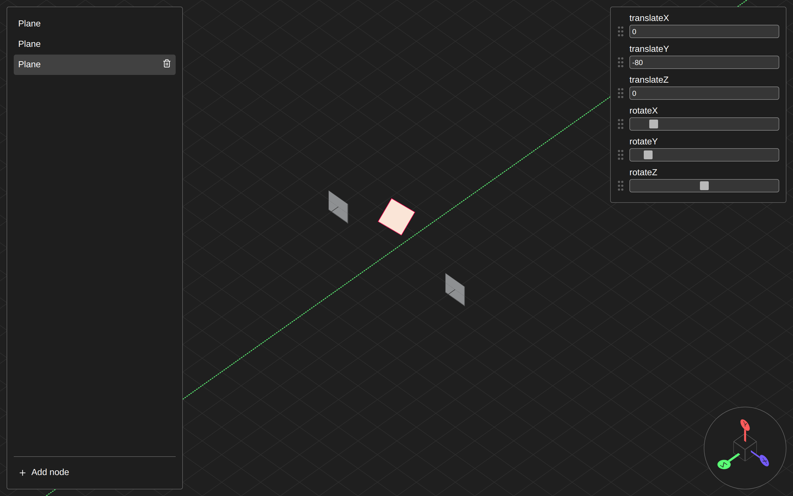

# 3D CSS Visualizer

A visual editor for building and exploring 3D scenes with **nothing but CSS transforms**: no WebGL, no Canvas, no 3D libraries. Every object in the scene is a DOM element, and its position and rotation become a CSS `transform` in real time.

Use it to experiment with `transform-style: preserve-3d`, see how the **order of transforms** changes the result, and prototype 3D layouts you can later port to plain CSS.




## Features

- **Node management:** add, select and delete planes from the scene panel.
- **Properties panel:** edit `translateX/Y/Z` (px) and `rotateX/Y/Z` (degrees, 0–360°) for the selected node.
- **Reorderable transform order:** drag properties to change the order they're applied in. In CSS, `rotateX(45deg) translateZ(100px)` isn't the same as `translateZ(100px) rotateX(45deg)`, and here you see the difference instantly.
- **Gizmo view selector:** switch between **isometric**, **front (Z)**, **side (X)** and **top (Y)** views with animated transitions. The gizmo itself is built with CSS 3D.
- **Visual guides:** axes and reference grids that adapt to the active view.
- **Quick deselect:** click the background to deselect the current node.

## Tech stack

| Area | Technology |
| --- | --- |
| UI | [React 19](https://react.dev) + [TypeScript](https://www.typescriptlang.org) |
| Build / dev server | [Vite 7](https://vite.dev) |
| State | [Zustand](https://zustand.docs.pmnd.rs) + [Immer](https://immerjs.github.io/immer/) middleware |
| Drag & drop | [dnd-kit](https://dndkit.com) (`core` + `sortable`) |
| Icons | [lucide-react](https://lucide.dev) |
| Styling | CSS Modules + plain CSS |

## Getting started

### Prerequisites

- Node.js 20.19+ or 22.12+ (required by Vite 7)
- npm

### Installation

```bash
git clone https://github.com/david-cerrato/3D-css-visualizer.git
cd 3D-css-visualizer
npm install
```

### Scripts

| Command | Description |
| --- | --- |
| `npm run dev` | Start the dev server with HMR (defaults to `http://localhost:5173`) |
| `npm run build` | Type-check (`tsc -b`) and create a production build in `dist/` |
| `npm run preview` | Serve the production build locally |
| `npm run lint` | Run ESLint across the project |

## Usage

1. Open the app. The scene starts with a single plane.
2. Click **Add node** in the scene panel to add more planes.
3. Select a node (from the list or by clicking it in the viewport) to open the properties panel.
4. Adjust translations and rotations, and **drag the ⋮⋮ handle** to reorder the transforms.
5. Use the gizmo in the corner: click the **cube** for the isometric view, or the **X**, **Y** and **Z** axes for the side, top and front views.

## How it works

Each node stores its transforms as an **ordered list** of properties:

```ts
interface ObjectProperty {
  id: string;               // 'translateX', 'rotateY', ...
  type: 'number' | 'range'; // number → px, range → deg
  value: number;
}
```

`SceneNode` turns that list, in order, into a CSS custom property:

```ts
node.properties
  .map(p => `${p.id}(${p.value}${p.type === 'number' ? 'px' : 'deg'})`)
  .join(' ')
// → "translateX(0px) translateY(0px) translateZ(0px) rotateX(45deg) ..."
```

The stylesheet applies it with `transform: var(--transform)` inside a viewport that uses `transform-style: preserve-3d`. Switching cameras just rotates the viewport container based on its `data-isometric` attribute.

## Project structure

```
src/
├── App.tsx                  # Main UI composition
├── components/
│   ├── controls/            # Properties panel (inputs, slider, reordering)
│   ├── cube/                # CSS 3D cube used in the view gizmo
│   ├── drag-and-drop/       # dnd-kit SortableItem wrapper
│   ├── scene-list/          # Side panel listing the scene nodes
│   ├── scene-node/          # Renders each node in the viewport
│   ├── view-selector/       # Gizmo for switching views
│   └── viewport/            # 3D scene, axes and grids
├── interfaces/              # Shared types (views, objects)
└── stores/
    ├── sceneStore.ts        # Zustand store: nodes, selection and actions
    ├── scene.actions.ts     # Add/delete node logic
    ├── sceneNode.interface.ts
    └── viewStore.ts         # Active camera view
```

## Roadmap

Ideas the data model already supports or that are pending in the code:

- [ ] Node hierarchy (parent/child). The model already has `parent` and `children`.
- [ ] Rename nodes from the list.
- [ ] Proper *debounced* updates for the inputs.
- [ ] Export the generated CSS for the scene.
- [ ] More properties: scale, size, color and `perspective`.

## Contributing

Contributions are welcome:

1. Fork the repository.
2. Create a branch: `git checkout -b feature/my-improvement`
3. Commit your changes and make sure `npm run lint` and `npm run build` pass.
4. Open a Pull Request.

## License

<!-- Pick a license (e.g. MIT), add a LICENSE file and update this section. -->
No license has been specified yet.
